# Esemény hozzáadása!

A tárgyak részletes leírása a tárgyakhoz köthető különböző események megadásával történik. Az ilyen típusú tárgyadat rögzítése teszi lehetővé, hogy a bevitt adatok teljes gazdagságukban a nemzetközi múzeumi szabványoknak (pl. LIDO) megfelelően továbbadhatóak legyenek. Minden olyan momentum eseménynek számít, ami a tárgy megelőző „életében" jelentős történés volt (pl. Készítés, Feltárás, Felhasználás).

A tárgyat leíró esemény az „Esemény hozzáadása!" opcióra kattintva megjelenő listából választható ki, a kiválasztani kívánt eseménytípusra kattintva. **Egy tárgyhoz több eseménytípus  is rendelhető.**

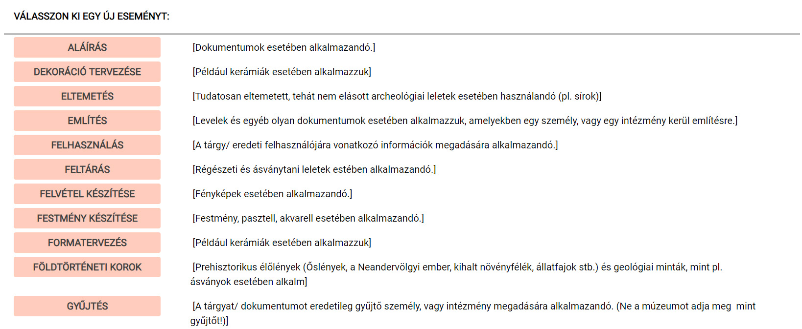

- Az eseménytípusok és használatuk részletezése a rendszerben található segédletben olvasható. Lásd: fenti menüsor ? ikon / Listák / Esemény típusok

A *Nyilvántartási rendeletben* meghatározott, leltárkönyvi adatok közül a rendszer többet is eseményként kezel. A leltárkönyvi rovatokat a következőképpen lehet megfeleltetni az eseményközpontú tárgyleírásnak:

|---------------------------|--------------|----------|
| Leltárkönyvi rovat        | Esemény      | Kérdőszó |
| Kor (a készítés ideje)    | Készítés     | Mikor?   |
| Keletkezés/készítés helye | Készítés     | Hol?     |
| Készítő/alkotó neve       | Készítés     | Ki?      |
| Használat helye           | Felhasználás | Hol?     |
| Használat ideje           | Felhasználás | Mikor?   |
| A felvétel ideje          | Készítés     | Mikor?   |
| A felvétel helye          | Készítés     | Hol?     |
| A felvétel készítője      | Készítés     | Ki?      |

1. tábla: Leltárkönyvi rovatok megfeleltetése eseményként
   - **A „Készítés" esemény adatait a rendszer tárgyspecifikusan képes kezelni** Festmény esetén a „Festmény készítése", rajz esetén a „Rajz készítése", fotó esetén a „Felvétel készítése", szöveges dokumentum esetén az „Írott/szerzett mű alkotása" eseményt válassza! Ezen kívül tárgyspecifikusan használhatók még a „Vázlat készítése", „Sokszorosító nyomólemez készítése", „Hangfelvétel készítése", „Dekoráció tervezése", „Nyomtatás", „Mintázás" és a „Koncepció megalkotása" eseménytípusok is.

Az eseménytípus megadása után a MúzeumDigitár rendszer kéri, hogy a **Ki?, Hol?, Mikor? **kérdéseket megválaszolva határozzuk meg pontosan a kiválasztott eseményt.

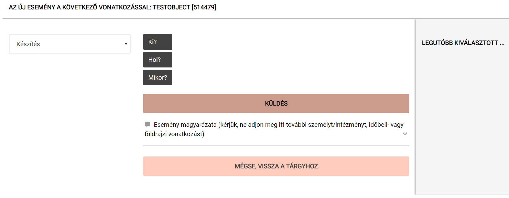

Itt az eseményben résztvevő személyt/intézményt *(pl. készítő, felhasználó, gyűjtő)*, a cselekmény helyszínét *(pl. készítés helye, használat helye, gyűjtés helye)* és a cselekmény idejét *(pl. készítés ideje, használat ideje, meghatározás időpontja)* lehet megadni a kérdőszóra kattintással. **Elég egy kérdőszóra válaszolni ahhoz, hogy az esemény típusú vonatkozás létrejöjjön, de az információ teljessége érdekében törekedjünk mindhárom adat megadására.**

A kérdőszóra kattintás után az adott vonatkozás (szereplő / helység / időbeli vonatkozás) keresési mezőjének kitöltésénél az adat gépelése közben felugrik a rendszer adatbázisában megtalálható, hasonló elemeinek listája, ahonnan kiválasztható a kívánt elem.

 Az adatok duplikálásának elkerülése végett mindig ellenőrizze, hogy nem-e szerepel már valamilyen formában az éppen felvételre kerülő adat a javaslati listán!

Ha nincs -- vagy nem helyesen szerepel -- a listán a bevinni kívánt meghatározás, akkor lehetőség van új elemként való felvételére. Minden esetben a keresőmező kitöltése után ENTER billentyűt nyomva lehet felvenni új adatot.

**Az új adat felvétele egyben annak adatbázisban történő rögzítését is jelenti, tehát az újonnan felvett adat a későbbi adatbevitel során listából választhatóvá válik, a MúzeumDigitár felhasználói közül 
bárki elérheti és a tárgyakhoz rendelheti.**
                                                                     
**Kérjük, hogy csak megfelelő körültekintéssel és alapossággal vegyen fel az adatbázisba új adatot!**

A rendszer karbantartása során az adatbázisba nem szabályszerűen bevitt adatokat az adatkapcsolatok létrejötte és a visszakereshetőség érdekében a MúzeumDigitár support-csapata az egységes és szabályos adatformára módosítja.

**Közreműködő (Ki?...)** esetén az eseményben résztvevő személyt/intézményt (pl. készítő, felhasználó, gyűjtő) határozzuk meg egyedi, az adott személy/intézmény egyértelműen beazonosító adatok alapján.

**Kerülje az „ismeretlen alkotó", „gyártó ismeretlen", fazekasmester, kovácsmester stb. általános leíró kifejezések használatát! Egyedileg nem meghatározható, nem nevesíthető, ismeretlen közreműködő esetén hagyja üresen a Ki? kérdőszót!**

Ha a mezőbe gépelés során felugró listán nincs -- vagy nem helyesen szerepel -- a bevinni kívánt meghatározás, akkor lehetőség van új elemként való felvételére. A keresőmező kitöltése után ENTER billentyűt
nyomva lehet felvenni új adatot.

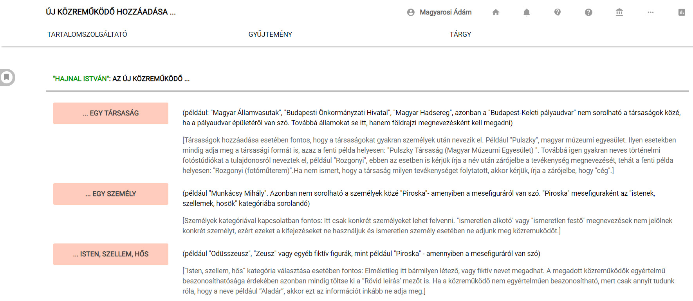

Az új közreműködő felvételénél első lépésként ki kell választani a kategóriát, ahova a szereplő besorolható: Az adott szereplő *egy társaság? vagy egy személy?* esetleg egy fiktív figura (*isten, szellem, hős*)? A megfelelő kategóriára kattintás után egy űrlapon lehet megadni az adott szereplő egyedi beazonosításához szükséges adatokat.

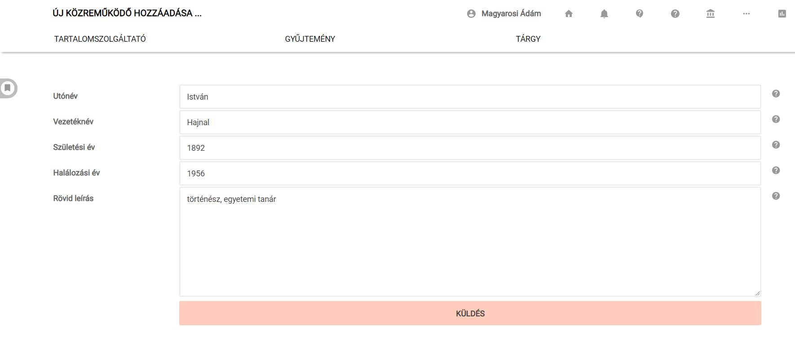

**Földrajzi vonatkozás (Hol?...)** felvétele esetén a cselekmény helyszínét (*pl. készítés helye, használat helye, gyűjtés helye*) határozzuk meg, térképen megjeleníthető módon.

 **A földrajzi vonatkozások egységes és helyes kitöltéséhez külön táblázat nyújt segítséget, lásd a szabályzat** *I. számú mellékletét. (kattints az ugráshoz)*](Mellekletek/utmutato_a_foldrajzi_vonatkozasok_felvetelehez.md)

Ha a mezőbe gépelés során felugró listán nincs -- vagy nem helyesen szerepel -- a bevinni kívánt meghatározás, akkor lehetőség van új elemként való felvételére. A keresőmező kitöltése után ENTER billentyűt
nyomva lehet felvenni új adatot.

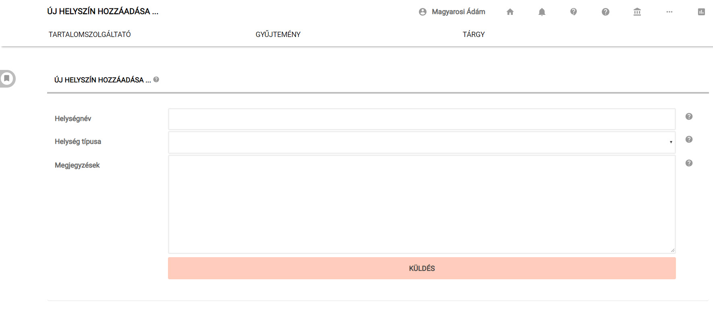

A „Küldés" gombra kattintva automatikusan felugrik egy térkép, amely a megadott helységet/utcanevet közelítő pontossággal ábrázolja. A helységnév esetleges módosítása esetén a „Go" gombra kattintva lehet újrakalibrálni a térképes nézetet.

A megjelenő térképen a Google-térképekhez hasonlóan húzással lehet helyzetet változtatni és a +/- jellel, vagy az egér görgőjével zoomolni, hogy részletes pontossággal meg lehessen adni az adatot. A térképen a meghatározni kívánt földrajzi elemre (település, utca, stb.) kattintva a rendszer betáplálja a geo-koordinátákat. Ha a felvenni kíván adatnál a térkép nem elég részletgazdag, akkor megközelítő pontossággal kattintson a térképre. A felugró ablakban található gombra kattintva fejezhető be a földrajzi vonatkozás felvétele.

(***A rendszer karbantartása során a MúzeumDigitár support-csapata a geo-koordinátákat pontosítja.)

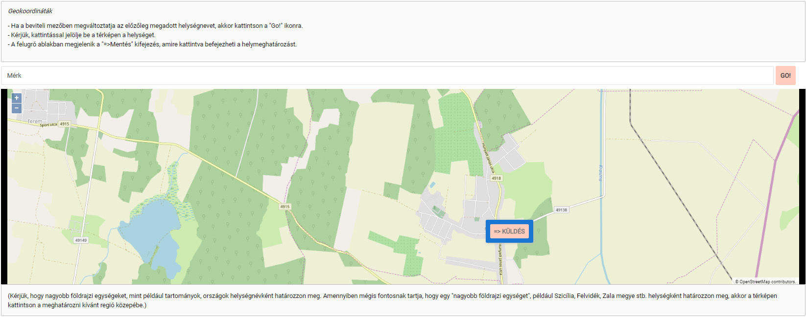

 **Ha a tárgyhoz kapcsolódó földrajzi vonatkozás szenzitív adatnak minősül** (pl. pontos régészeti helyszín vagy fotó készítésének pontos helyszíne esetén), akkor ne az Eseménynél, hanem a „Kiegészítő" fül  Pontos helyszín mezőben vegye fel a kívánt adatot.

**Időbeli vonatkozás (Mikor?...)** esetén a kiválasztott eseménytípus cselekményének idejét (pl. készítés ideje, használat ideje, meghatározás időpontja) lehet megadni.

**Az időbeli vonatkozás egységes és helyes kitöltéséhez külön táblázat nyújt segítséget, lásd a szabályzat **

*II. számú mellékletét*. *(kattints az ugráshoz)*](?lan=hu&q=Mell%C3%A9kletek/2.%20%C3%9Atmutat%C3%B3%20id%C5%91beli%20vonatkoz%C3%A1sok%20felv%C3%A9tel%C3%A9hez)

Ha a mezőbe gépelés során felugró listán nincs -- vagy nem helyesen szerepel -- a bevinni kívánt meghatározás, akkor lehetőség van új elemként való felvételére. A keresőmező kitöltése után ENTER billentyűt nyomva lehet felvenni új adatot.

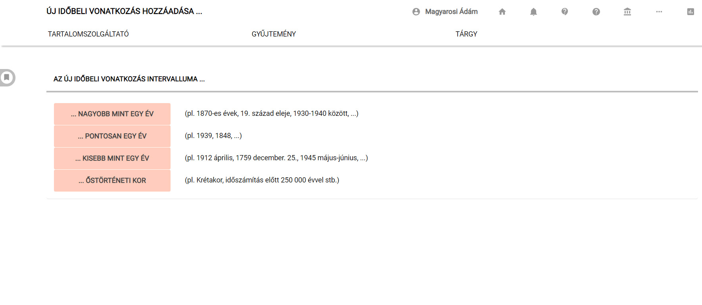

Az új időbeli vonatkozás felvételénél első lépésként ki kell választani a kategóriát, ahova a felvenni kívánt időpont besorolható. A megfelelő kategóriára kattintás után egy űrlapon lehet megadni az időbeli vonatkozás számokkal körülírható, az adatbázis számára kezelhető számadatokat.

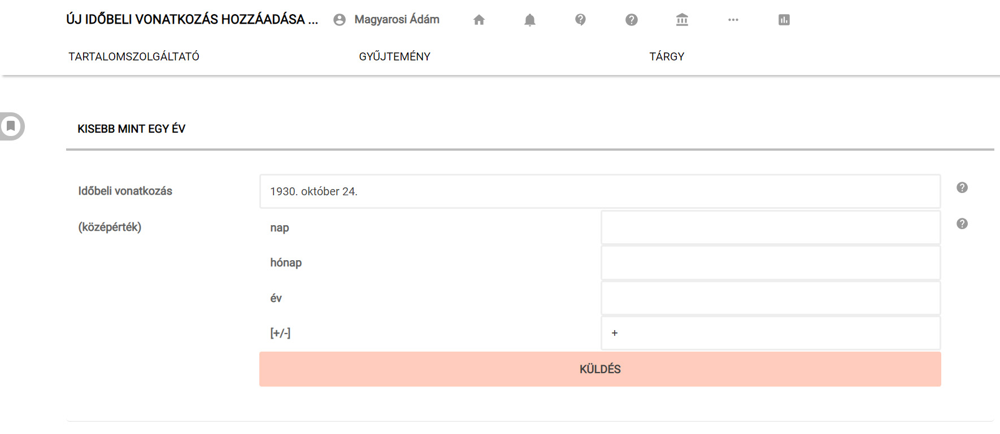

 **Ha az évszám 4-nél kevesebb számból áll** (pl. 263, 43, stb. Akkor ahhoz, hogy a rendszer kezelni tudja a számot, 0-val kell kipótolni a hiányzó helyi értékeket. Tehát a következő módon kell az évszámot megadni: 0263, 0043, stb.

 **Körülbelüli időpontok kifejezésére a Mikor és az időpont között megjelenő hármas egyenlőségjelre kattintással, és ezzel az egyenlőség hullámvonalra változtatásával van lehetőség. TILOS a „kb." és „körül" kifejezések használata!**

A nyomtatott leltárkönyv modul használata esetén a körülbelüliséget kifejező hullámvonal az adat utáni „körül" kifejezésre változik. Tehát a rendszerben a „Mikor: \[\~\] 1932" típusú kifejezés a nyomtatott leltárkönyvi rovatban „1932 körül" adatként fog megjelenni.

**Lehetőség van bizonytalan Személyi/intézményi és Földrajzi vonatkozású adatok felvételére is.** Ezt szintén a kérdőszavak mögötti hármas egyenlőségjelre kattintva tudjuk megtenni. Ezt követően a körülbelüliséget a rendszerben szintén hullámvonal jelzi. Leltárkönyv nyomtatása esetén a bizonytalanként rögzített személyi/intézményi és földrajzi vonatkozású adat után „(valószínűleg)" kifejezés lesz olvasható.

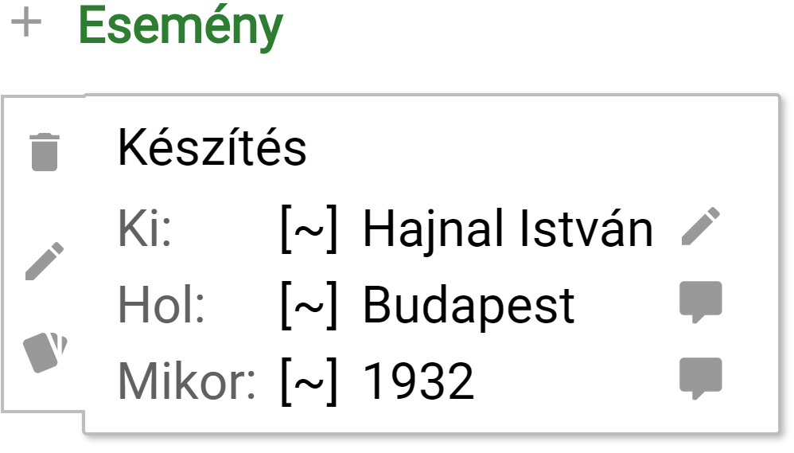

**Egy eseménytípus akár többször is felvehető, ha több közreműködő, helyszín vagy időpont kapcsolódik egy eseménytípushoz.** Például többen készítették az adott tárgyat, vagy több helyen is használták a
tárgyat. **Ilyenkor NE az eseményhez tartozó információt, hanem magát az eseményt többszörözze!** Például:

A megjelenő adatbeviteli űrlapok adatmezői mellett látható információs ikonok minden esetben segítik az adatok helyes megadását.

Listából választás esetén az adott listaelemre kattintás után, új vonatkozás felvétele esetén pedig az adatbeviteli űrlapon a Küldés gombra kattintva a rendszer hozzárendeli a kérdőszóhoz a kívánt elemet.

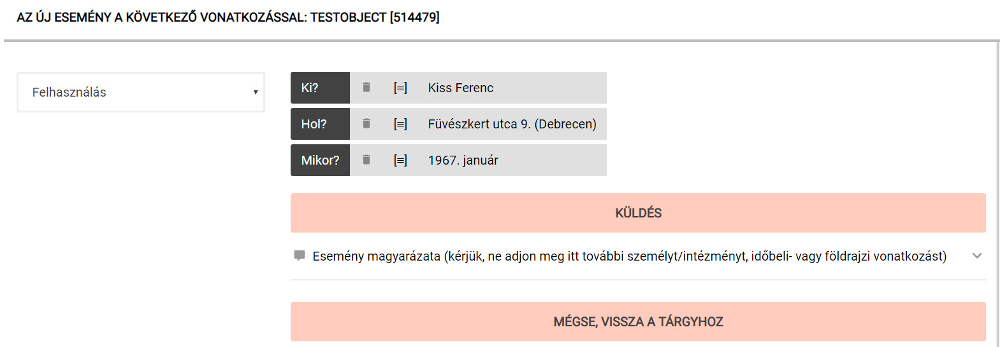

**A felvett Esemény véglegesítése a „Küldés" gombra kattintással történik.**  Ennek hiányában az adatok elvesznek!

Az Eseményként rögzített adatok -- és maga az Esemény típusa is -- bármikor módosíthatók, törölhetők és klónozhatók az Esemény adatok címkéjén megjelenő  és  valamint  ikonok segítségével.

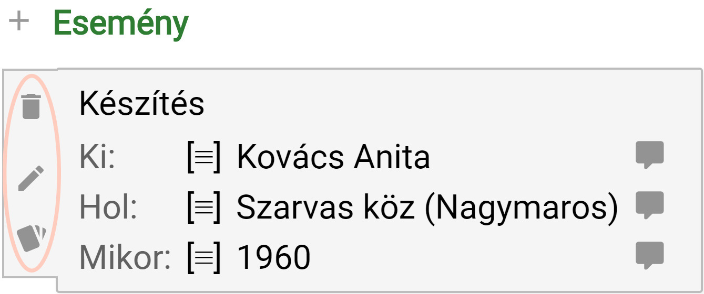

